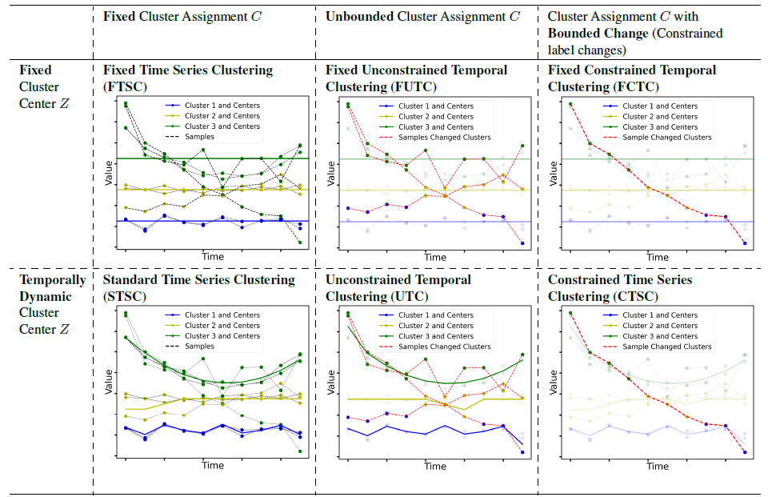

Introduction
============

tscluster is a Python package for temporal clustering. 
It provides subpackages with different techniques to temporal clustering e.g. ``opttscluster`` and ``tskmeans``. In ``opttscluster``, we present a generalized design space for temporal clustering based on two key choices: 

1. Are cluster definitions (centers) Z allowed to dynamically change over time? 
2. Are time series entities (e.g., locations) allowed to change cluster assignment C over time, and if so, how much? 

Leveraging this design space, the table below shows six possible cluster schemes and visually illustrates some of these key design choice alternatives.

Purpose and Benefits
--------------------
With tscluster, you can:

- Cluster time series data with optimality guarantees using ``opttscluster`` subpackage with any of the six shemes in the design space introduced in this paper. 
- Use k-means for time series clustering using the ``TSKmeans`` class (built on top of ``tslean``) in the ``tskmeans`` subpackage.
- Do time-series label analysis (TLA) clustering using the  ``TSGlobalKmeans`` class in the ``tskmeans`` subpackage.
- Preprocess time series data using its ``preprocessing`` subpackage.
- Evaluate clustering alogrithms using ``metrics`` subpackage.
- Seamlessly generate plots of the time series and their cluster using its ``tsplot`` subpackage. 

License
-------
This software is distributed under the MIT License.

Contributors
------------
- Jolomi Tosanwumi (University of Toronto, CA)