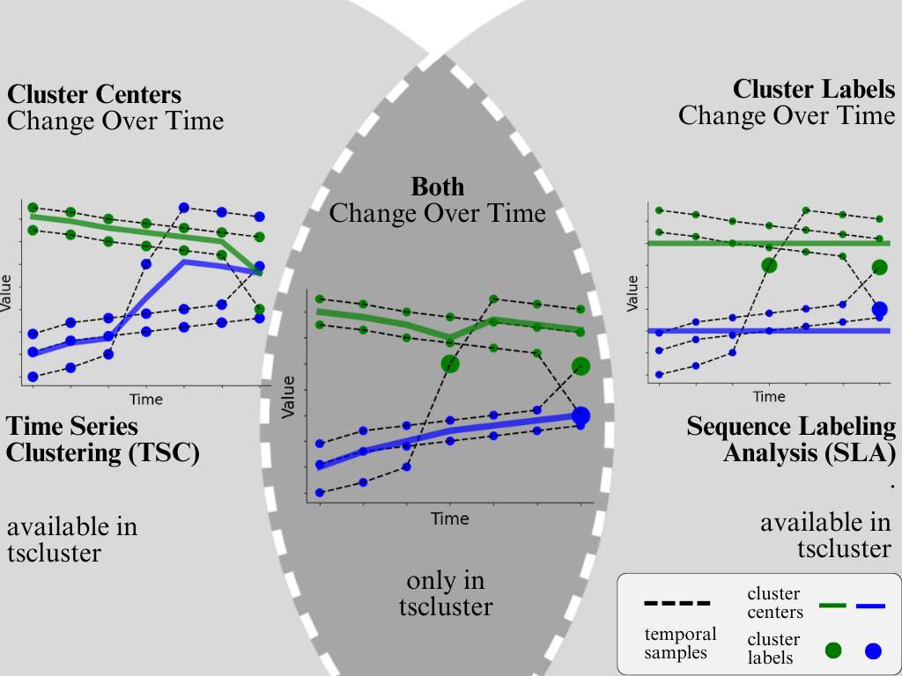
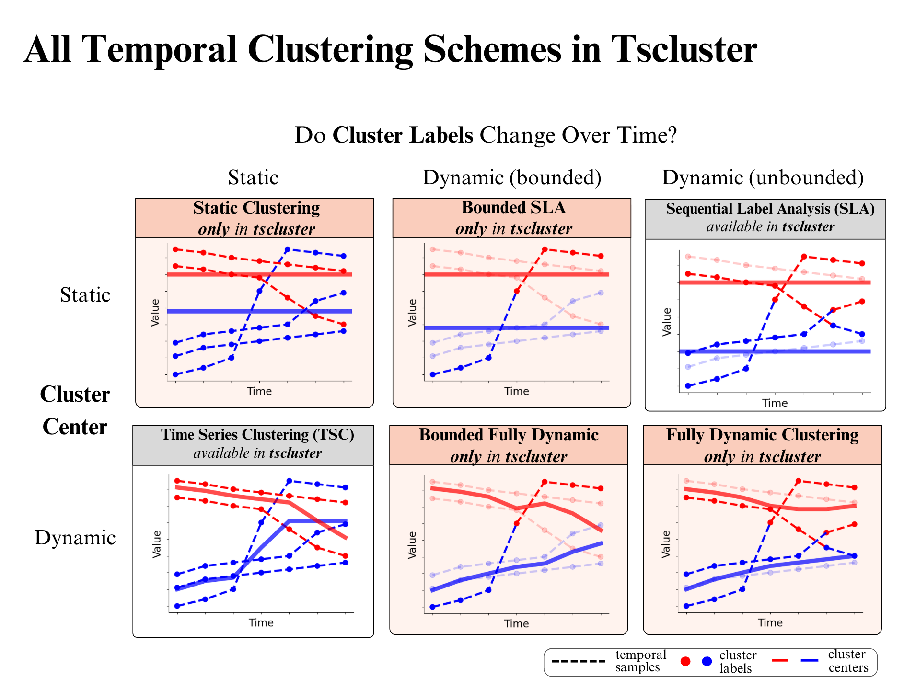

Introduction
============

Overview
--------

Temporal clustering is a popular unsupervised machine-learning task with applications to datasets including census, finance, and healthcare data that is used to group time series data into different groups according to common temporal trends.

In this tscluster open-source toolbox, we provide a range of methods for temporal clustering that include both traditional and novel methods for temporal clustering as we illustrate below:

As shown above, existing methods of temporal clustering in literature fall under two categories:

- **Time Series Clustering (TSC)** [*Aghabozorgi et al, 2014*]: On the above left is shown an example of TSC which involves grouping time series (as multidimensional vectors) based on similarity metrics (e.g. euclidean distance). While cluster centers change over time, the cluster labels for each entity remain constant.  For example, one can identify similar groups of stocks by clustering them on their daily price data.
- **Sequence Labelling Analysis (SLA)** [*Delmelle et al, 2016*]: On the above right is shown an example of SLA that assumes a constant (non-changing) cluster center, but which allows for the cluster labels of each entity to change over time unlike TSC.  For example, SLA could be used to identify trends in gentrification as indicated by a census tract transitioning from a low income and high unemployment cluster label to a high income and low unemployment cluster label.

While tscluster supports both TSC and SLA in a common framework, it also provides novel combinations of these methods (e.g., allowing both dynamic cluster centers and cluster labels) as we outline next.

In this table, we organize all clustering methods according to two choices:

1. In the rows we can choose to have either static (unchanging) cluster centers or dynamic (changing) cluster centers over time.
2. In the columns we can choose how labels are allowed to change over time: static (no label change), unbounded (unlimited label change), or bounded (an upper limit on the number of label changes allowed).  

Perhaps one of the most important novel tools in tscluster is specifically the capability to perform Bounded Fully Dynamic clustering (middle bottom), which allows us to identify the (anomalous) entities that diverge most from existing dynamic trends.  As an example use case for census analysis, we can identify census tracts that change due to external forces (e.g., significant rezoning) by using tscluster's Bounded Fully Dynamic clustering scheme to constrain the number of cluster changes.

Purpose and Benefits
--------------------
With tscluster, you can:

- Clustering temporal data using any combination of static or fixed cluster labels and centers with optimality guarantees underscored by Mixed Linear Integer Programming.
- Finding entities that are most likely to change cluster label assignment if a total number of n label changes is allowed.

We provide two implementations for different use cases:

- **`opttscluster` subpackage**: Offers a **guaranteed globally optimal** solution based on **Mixed Integer Linear Programming (MILP)** formulations, implemented using the `gurobipy` package.  
  *Requires an active Gurobi license.*

- **`greedytscluster` subpackage**: Provides a **more scalable**, but **non-optimal** alternative based on **Maxima Minimization (MM)** algorithms.  
  *Does not require a Gurobi license.*

Tscluster also encompasses the two existing approaches by providing the following classes available in its tskmeans subpackage:
- TSKmeans class for TSC (built on top of tslearn).
- TSGlobalKmeans class for SLA (built on top of sklearn).

Tscluster implemented some utility tools in the following subpackages to help in temporal clustering tasks.
- Preprocessing: This can be used to preprocess and load temporal data. Data can be loaded from either a directory, a file, a list of Pandas DataFrames, or a numpy array
file (.npy).

.. image:: source/images/tscluster_schema.png

- metric: contains useful temporal clustering evaluation metrics such as inertia and max_dist.
- tsplot: Useful for seamlessly generating 2D time series plots and 3D waterfall plots of all features within temporal data and the cluster centers. 

Example usage
-------------
For an example notebook with applications to real world data, see this `Colab notebook  <https://colab.research.google.com/drive/1dH3sj8jybbOomuwQR9eGhNnYqyZ4OKZM?usp=sharing>`_

License
-------
This software is distributed under the MIT License.

Cite Our Work
-------
If you used this package in your works, please cite the following paper:

Tosanwumi, J., Liang, J., Silver, D., Fosse, E., & Sanner, S. (2025). tscluster: A python package for the optimal temporal clustering framework. Environment and Planning B: Urban Analytics and City Science, 52(4), 1014-1024.

@article{doi:10.1177/23998083241293833,
author = {Jolomi Tosanwumi and Jiazhou Liang and Daniel Silver and Ethan Fosse and Scott Sanner},
title ={tscluster: A python package for the optimal temporal clustering framework},
journal = {Environment and Planning B: Urban Analytics and City Science},
volume = {52},
number = {4},
pages = {1014-1024},
year = {2025},
doi = {10.1177/23998083241293833}}

Contributors
------------
- Jolomi Tosanwumi (University of Toronto, CA)
- Jiazhou Liang (University of Toronto, CA)