Tutorial with Real World Data
=============================

This tutorial notebook demonstrates the detailed process of the Toronto
neighborhoods changes case study using Sequence Label Analysis (SLA) and
Bounded Dynamic Clustering (BDC) in *tscluster*.

The dataset in this case study has :math:`F=4` socioeconomic indicators
over :math:`T=6` timestamps from 1996 to 2021. This temporal data comes
from the \`Census of Canada’ data provided by Statistics Canada via
CHASS Data Centre. The geographic unit for this analysis was the Forward
Sortation Area (FSA), with all :math:`N = 96` entities transformed using
Z-score normalization across each timestamp per feature.

The objective of this case study is identifing different types of FSAs
in Toronto by clustering their historical temporal data, and second,
examined atypical FSAs that do not neatly fit into a single type,
quantified by the frequency of label changes within each FSA.

We identified four different types of FSA in Toronto and captured the
FSA that exhibits the most divergent transition from one neighbourhood
type to another (i.e. the most frequent changes in its cluster label).

**Note: Due to the dataset size of this case study, this notebook
requires a valid license from Gurobi to run the clustering algorithms.
Gurobi offers a free academic license for academic users. For more
information about Gurobi licenses, please refer to the website**
`here <https://www.gurobi.com/academia/academic-program-and-licenses/>`__\ **.**

.. code-block:: python

    # download and install tscluster via pypi
    !pip install tscluster
    # ensure reproducible clustering result
    !pip install scikit-learn==1.4.0

.. parsed-literal::

    Requirement already satisfied: scikit-learn==1.4.0 in /usr/local/lib/python3.10/dist-packages (1.4.0)
    Requirement already satisfied: numpy<2.0,>=1.19.5 in /usr/local/lib/python3.10/dist-packages (from scikit-learn==1.4.0) (1.26.4)
    Requirement already satisfied: scipy>=1.6.0 in /usr/local/lib/python3.10/dist-packages (from scikit-learn==1.4.0) (1.11.4)
    Requirement already satisfied: joblib>=1.2.0 in /usr/local/lib/python3.10/dist-packages (from scikit-learn==1.4.0) (1.4.2)
    Requirement already satisfied: threadpoolctl>=2.0.0 in /usr/local/lib/python3.10/dist-packages (from scikit-learn==1.4.0) (3.5.0)
    

.. code-block:: python

    #import the required libraries
    import pandas as pd
    import numpy as np
    import matplotlib.pyplot as plt
    import seaborn as sns
    import os
    from typing import List, Tuple

Pre-processing
--------------

Dataset description
~~~~~~~~~~~~~~~~~~~

The temporal data used in this case study is sourced from the ‘Census of
Canada’ data provided by Statistics Canada through the CHASS Data Centre
(https://datacentre.chass.utoronto.ca/).

The geographic unit for this analysis was the Forward Sortation Area
(FSA), encompassing all :math:`N = 96` entities.

There are :math:`F = 4` features observed across :math:`T = 6` years
spanning from 1996 to 2021. Below is a brief description of each feature
and their respective names that will be used in this notebook:

-  **Population Density**: The population density of each FSA, obtained
   from the total population divided by the area of each FSA from the
   shapefile.
-  **Median Total Income**: Median income among recipients aged 15 years
   and over.
-  **Young Population**: Percentage of the young (aged 20 - 34)
   population in the total popluation of each FSA.
-  **Visible Minority**: Percentage of the visible minority population
   based on the Statistics Canada’s definition of visible minority.

For more detailed information about how these features were derived,
please refer to the original paper.

.. code-block:: python

    # Download the dervied temporal data and load it into a pandas dataframe
    # (also available in the test/toronto_fsa folder of the *tscluster* github repo)
    temporal_data = pd.read_csv('https://raw.githubusercontent.com/tscluster-project/tscluster/main/test/toronto_fsa/toronto_census_data_by_fsa.csv')
    # Display the first few rows of the datax
    temporal_data.head()

.. raw:: html

    
      

        

    
    <table border="1" class="dataframe">
      <thead>
        <tr style="text-align: right;">
          <th></th>
          <th>year</th>
          <th>FSA</th>
          <th>Population Density</th>
          <th>Visible Minority</th>
          <th>Median Total Income</th>
          <th>Young Population</th>
        </tr>
      </thead>
      <tbody>
        <tr>
          <th>0</th>
          <td>1996</td>
          <td>M1B</td>
          <td>0.001630</td>
          <td>0.719880</td>
          <td>20097.0</td>
          <td>0.246507</td>
        </tr>
        <tr>
          <th>1</th>
          <td>1996</td>
          <td>M1C</td>
          <td>0.002145</td>
          <td>0.338884</td>
          <td>26935.0</td>
          <td>0.207376</td>
        </tr>
        <tr>
          <th>2</th>
          <td>1996</td>
          <td>M1E</td>
          <td>0.002931</td>
          <td>0.367302</td>
          <td>19992.0</td>
          <td>0.226050</td>
        </tr>
        <tr>
          <th>3</th>
          <td>1996</td>
          <td>M1G</td>
          <td>0.003215</td>
          <td>0.514389</td>
          <td>16749.0</td>
          <td>0.242840</td>
        </tr>
        <tr>
          <th>4</th>
          <td>1996</td>
          <td>M1H</td>
          <td>0.003692</td>
          <td>0.484527</td>
          <td>18399.0</td>
          <td>0.250900</td>
        </tr>
      </tbody>
    </table>
    

        

    
      

        <button class="colab-df-convert" onclick="convertToInteractive('df-161c458a-25de-4ace-95b2-966823cc8822')"
                title="Convert this dataframe to an interactive table."
                style="display:none;">
    
      <svg xmlns="http://www.w3.org/2000/svg" height="24px" viewBox="0 -960 960 960">
        <path d="M120-120v-720h720v720H120Zm60-500h600v-160H180v160Zm220 220h160v-160H400v160Zm0 220h160v-160H400v160ZM180-400h160v-160H180v160Zm440 0h160v-160H620v160ZM180-180h160v-160H180v160Zm440 0h160v-160H620v160Z"/>
      </svg>
        </button>
    
      
    
        
      

    
    
    

      <button class="colab-df-quickchart" onclick="quickchart('df-76169c76-599a-4a01-8bb6-e467b8a4b92d')"
                title="Suggest charts"
                style="display:none;">
    
    <svg xmlns="http://www.w3.org/2000/svg" height="24px"viewBox="0 0 24 24"
         width="24px">
        <g>
            <path d="M19 3H5c-1.1 0-2 .9-2 2v14c0 1.1.9 2 2 2h14c1.1 0 2-.9 2-2V5c0-1.1-.9-2-2-2zM9 17H7v-7h2v7zm4 0h-2V7h2v10zm4 0h-2v-4h2v4z"/>
        </g>
    </svg>
      </button>
    
    
    
      
    

    
        

      

    

The example above displays data for 5 entities (i.e. FSA) with the
values of each studied feature in the year 1996. The FSA code for each
entity is labeled in the column ‘FSA’, and the year is indicated in the
‘year’ column.

.. code-block:: python

    print('unique year:', temporal_data['year'].unique())
    print('number of unique fsa:', len(temporal_data['FSA'].unique()))

.. parsed-literal::

    unique year: [1996 2001 2006 2011 2016 2021]
    number of unique fsa: 96
    

There are :math:`T = 6` timestamps and :math:`N = 96` FSA entities in
this temporal dataset.

Missing value
~~~~~~~~~~~~~

.. code-block:: python

    #replace 0 with nan
    temporal_data.replace(0,np.nan,inplace=True)
    #check for missing values
    temporal_data.isnull().sum()

.. parsed-literal::

    year                    0
    FSA                     0
    Population Density     96
    Visible Minority        0
    Median Total Income     1
    Young Population        0
    dtype: int64

There are 96 missing timestamps in the feature ‘Population Density’ and
1 missing timestamp in the feature ‘Young Population’. We used linear
interplation to impute these missing value.

.. code-block:: python

    #arrange by fsa and year
    temporal_data.sort_values(by=['FSA','year'],inplace=True)
    temporal_data.reset_index(drop=True,inplace=True)
    
    #select fsa that exist in all years
    common_fsa = temporal_data[temporal_data['year'].isin([1996])]['FSA'].tolist()
    
    for fsa in common_fsa:
        #select the current fsa
        current_fsa = temporal_data[temporal_data['FSA'].isin([fsa])]
        for feature in current_fsa.columns:
            if feature not in ['FSA','year']:
                #interpolate missing values
                current_fsa.loc[:,feature] = current_fsa.loc[:,feature].interpolate(method='linear')
                #fill missing values at the beginning of the series (using the first valid value)
                current_fsa.loc[:,feature] = current_fsa.loc[:,feature].bfill()
        #update the temporal data
        temporal_data.update(current_fsa)

.. code-block:: python

    # check for missing values after interpolation
    temporal_data.isnull().sum()

.. parsed-literal::

    year                   0
    FSA                    0
    Population Density     0
    Visible Minority       0
    Median Total Income    0
    Young Population       0
    dtype: int64

Z-score Normalization
~~~~~~~~~~~~~~~~~~~~~

Note that different features are in different scales and units. For
example, ‘Total Median Income’ is recorded in Canadian Dollars, while
‘Young Population’ is a percentage. Therefore, we utilize Z-score
normalization per timestamp :math:`T` per feature :math:`F` to ensure
that all features are on the same scale and to eliminate the increasing
trends caused by external factors (e.g., inflation affecting ‘Total
Median Income’).

Z-score normalization can be performed manually by users or using
available pre-processing tools in *tscluster*. In this exercise, we will
demonstrate the second approach.

Loading Data into *tscluster*
^^^^^^^^^^^^^^^^^^^^^^^^^^^^^

*tscluster* accepts several formats of temporal datasets. Please refer
to the documentation for all available formats.

One of the acceptable formats is the path of a directory containing
:math:`T` Pandas DataFrames, where each DataFrame represents one
timestamp in the temporal dataset. We have broken down the temporal data
from the previous section into :math:`T = 6` individual DataFrames and
stored them in a directory named ‘toronto_fsa_by_year’.

.. code-block:: python

    #create a folder to save the data
    folder = 'toronto_fsa_by_year'
    #check if the folder exists
    if not os.path.exists(folder):
        #if not, create the folder
        os.makedirs(folder)
    
    #save the data by year
    for year in temporal_data['year'].unique():
        #select the current year
        current_year = temporal_data[temporal_data['year'].isin([year])].copy()
        #sort by fsa to ensure the order is consistent
        current_year = current_year.sort_values(by='FSA')
        #set the index to the FSA
        current_year.index = current_year['FSA'].to_list()
        current_year.drop(columns=['FSA','year'],inplace=True)
        #save the current year into a csv file with name timestep_year.csv with the FSA as the index
        current_year.to_csv(os.path.join(folder,'timestep_'+str(year)+'.csv'), index = True)

We loaded the saved DataFrame using the ``load_data`` function in
*tscluster*. The ``load_data`` function contains two outputs: - (1) a
3-D numpy array with dimension :math:`(T,N,F)` (i.e. (Number of year,
Number of FSAs, Number of features)) - (2) a Python ``dictionary`` that
contains labels of timestamps (with key ``T``), entities (with key
``N``) and features (with key ``F``)

.. code-block:: python

    from tscluster.preprocessing.utils import load_data
    # load the data using the directory where the data is saved
    # (use_suffix_as_label=True ensures that the suffix of the file is used as the label of entites and features)
    # index_col=[0] ensures that the first column is used as the label for each entity
    # header=0 ensures that the first row is used as the label for each feature
    temporal_data, label_dict = load_data('./toronto_fsa_by_year', use_suffix_as_label=True,
                                  read_file_args={'index_col': [0], 'header': 0})
    # the 3-D numpy array temporal_data contains the data with shape (n_features, n_samples, n_timesteps)
    print(f"shape of temporal_data is {temporal_data.shape}")

.. parsed-literal::

    shape of temporal_data is (6, 96, 4)
    

the ``label_dict`` contains the labels for the timestamps, entities and
features from the Pandas DataFrame

.. code-block:: python

    # first 5 entities of each label
    label_dict['T'][:5], label_dict['N'][:5], label_dict['F'][:5]

.. parsed-literal::

    (['1996', '2001', '2006', '2011', '2016'],
     ['M1B', 'M1C', 'M1E', 'M1G', 'M1H'],
     ['Population Density',
      'Visible Minority',
      'Median Total Income',
      'Young Population'])

As shown above, there are :math:`T = 6` years :math:`N = 96` FSAs and
:math:`F=4` features in the loaded data array.

Z-score normalization using *tscluster*
^^^^^^^^^^^^^^^^^^^^^^^^^^^^^^^^^^^^^^^

.. code-block:: python

    # loaded the z-score standard scaler from tscluster
    from tscluster.preprocessing import TSStandardScaler
    
    scaler = TSStandardScaler(per_time=True) # initialize a time series standard scaler
    scaler.fit(temporal_data) # fit
    temporal_data_scaled = scaler.fit_transform(temporal_data) # transform
    print(f"temporal_data_scaled shape is {temporal_data_scaled.shape}")
    print()
    print("The value of four features of the first five FSAs in 1996 are:")
    print(temporal_data_scaled[0, :5, :])
    

.. parsed-literal::

    temporal_data_scaled shape is (6, 96, 4)
    
    The value of four features of the first five FSAs in 1996 are:
    [[-0.97548338  2.19399549 -0.32845476 -0.2820364 ]
     [-0.82692074  0.03330543  0.63842612 -0.82223389]
     [-0.60021924  0.19446558 -0.34330157 -0.56444238]
     [-0.51810172  1.02862245 -0.80185592 -0.33266133]
     [-0.38065401  0.8592721  -0.56854889 -0.22139573]]
    

Visualizing the temporal dataset
~~~~~~~~~~~~~~~~~~~~~~~~~~~~~~~~

After normalizing the data, we visualized the temporal data using the
``tsplot`` module in *tscluster*. The output of the ``tsplot.plot()``
function will be a group of time series plots, each visualizing
entities’ time series for one of the four features in the temporal
dataset.

.. code-block:: python

    from tscluster.tsplot import tsplot
    fig, ax = tsplot.plot(X=temporal_data_scaled, label_dict=label_dict,figsize=(7,16),
                          ylabel = 'Normalized Values',xlabel='Year')
    plt.show()

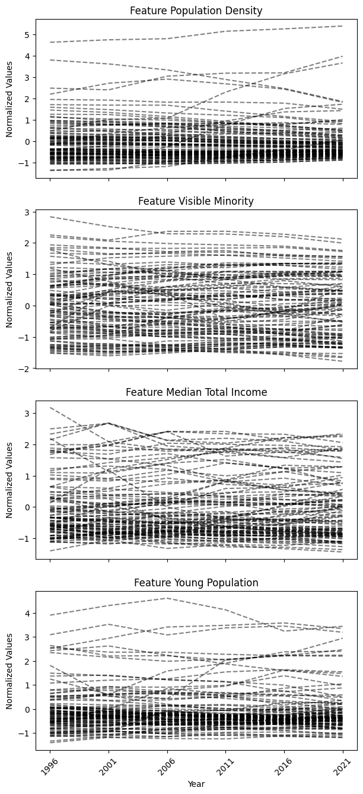

Clustering
----------

We first identified the different types of FSAs in Toronto by clustering
their historical temporal data, and second, examined atypical FSAs that
do not neatly fit into a single type, quantified by the frequency of
label changes within each FSA.

To illustrate the distinctive capabilities of *tscluster*, we show both
Social Label Analysis (SLA), a common method for neighbourhood change
analysis (Delmelle, 2016b), and Bounded Dynamic Clustering (BDC) (for
this exercise, we limited the maximum number of changes to 1. Only a
single FSA with the most diverged transition will change its label).

This dual approach allows us to compare SLA with the novel BDC in
handling temporal data for neighbourhood change analysis.

Social Label Analysis (SLA)
~~~~~~~~~~~~~~~~~~~~~~~~~~~

Social Label Analysis (SLA) is a traditional method in the analysis of
trends and changes in temporal data in neighbourhoods. It allows for the
cluster labels of each entity to change over time by clustering each
timestamp independently and assuming static cluster centers.

SLA gains insight into the evolution of a given neighbourhood by
analyzing changes in its cluster labels over time, which reveal possible
transitions between different types of neighbourhoods.

Using Elbow method to determine the number of clusters
^^^^^^^^^^^^^^^^^^^^^^^^^^^^^^^^^^^^^^^^^^^^^^^^^^^^^^

The first critical problem for clustering algorithms that require a
pre-defined number of clusters is deciding the optimal number of
clusters :math:`K`. For this exercise, we used the ‘Elbow method with
Sum of Squares’ in the ``yellowbrick`` package. This method applies
K-means clustering with a range of :math:`K` values and identifies the
:math:`K` value where the sum of squared errors exhibits the maximum
curvature.

To simulate the setting of SLA, we also need to breaking the Numpy array
``temporal_data_scaled`` that contains the normalized time series of
each FSA in four features into a Numpy array of individual timestamp
data with dimension :math:`(T \times N, F)`.

.. code-block:: python

    #breaking time series data into pointwise data
    timestamp_data = temporal_data_scaled.reshape(96*6,4)
    timestamp_data.shape

.. parsed-literal::

    (576, 4)

.. code-block:: python

    # we will use the elbow method to determine the optimal number of clusters
    from sympy import false
    from yellowbrick.cluster import KElbowVisualizer
    from sklearn.cluster import KMeans
    
    model = KMeans(random_state=4,n_init=10)
    visualizer = KElbowVisualizer(model, k=(2,10),timings=False, ax=plt.gca())
    visualizer.fit(timestamp_data)       # Fit data to visualizer
    plt.title('Elbow Method for Optimal k using Sum of Square Error')
    plt.xlabel('k')
    plt.ylabel('Sum of Squared Error')
    plt.show()

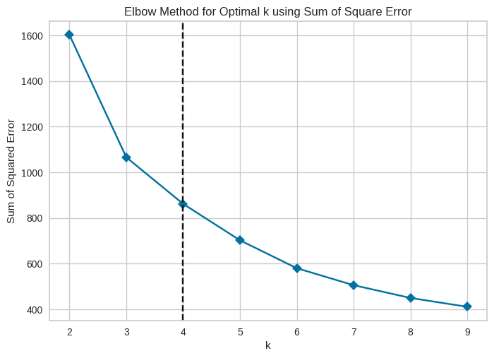

We decided the number for :math:`K` will be 4 in this case.

SLA in *tscluster*
^^^^^^^^^^^^^^^^^^

There are two approaches in *tscluster* for Sequence Label Analysis
(SLA):

-  ``TSGlobalKmeans``: This provides the traditional SLA approach, using
   K-means clustering from scikit-learn with timestamp entities, and
   assigns the labels of each timestamp back to the original temporal
   data of each FSA.

-  ``OptTSCluster``: This is a novel Mixed Linear Integer Programming
   approach, using constrained programming techniques to allow cluster
   label changes across time while keeping clusters static over time.
   This approach also guarantees global optimality and reproducibility
   compared to the traditional K-means approach.

In the notebook, we will demonstrate ``TSGlobalKmeans`` and reveals
potential problem in this tranditional approach due to the lack of
global optimality and reproducibility. Appendix 1 shows the same
appoarch with \`OptTSCluster.

.. code-block:: python

    # Using TSGlobalKmeans
    from tscluster.tskmeans import TSGlobalKmeans
    # initialize the SLA clustering method with the number of cluster = 4
    sla = TSGlobalKmeans(n_clusters=4, random_state=4)
    # clustering the normalized temporal data with SLA
    sla.fit(temporal_data_scaled, label_dict=label_dict)
    # print the number of entities that show cluster label changes
    print(f"total number of cluster changes is: {sla.n_changes_}")

.. parsed-literal::

    total number of cluster changes is: 37
    

**Note:** Since traditional K-means clustering is sensitive to
initialization and does not guarantee reproducibility, the clustering
results can be differ across different sklearn/tslearn versions and
settings.

We can also obtain the cluster labels of each FSA

.. code-block:: python

    cluster_label_sla = sla.labels_
    # the cluster labels for the first 5 entities
    cluster_label_sla[:5]

.. parsed-literal::

    array([[1, 1, 1, 1, 1, 1],
           [0, 0, 0, 0, 0, 0],
           [0, 1, 1, 1, 1, 1],
           [1, 1, 1, 1, 1, 1],
           [1, 1, 1, 1, 1, 1]], dtype=int32)

Each FSA has 6 cluster labels, each representing the cluster label of
that FSA at the current timestamp (i.e., year) in the temporal data
spanning from 1996 to 2021. We also identified the FSAs that exhibit
changes in cluster labels over time.

.. code-block:: python

    #the cluster label of first 5 FSA that exhibit cluster label changes
    cluster_label_sla[[label_dict['N'].index(i) for i in sla.get_dynamic_entities()[0]]][:5]

.. parsed-literal::

    array([[3, 0, 3, 0, 0, 0],
           [1, 0, 1, 1, 1, 1],
           [3, 2, 3, 3, 3, 3],
           [0, 0, 0, 3, 0, 0],
           [2, 2, 0, 3, 3, 3]], dtype=int32)

.. code-block:: python

    # the FSA code of first 5 FSA that exhibit cluster label changes
    sla.get_dynamic_entities()[0][:5]

.. parsed-literal::

    ['M3B', 'M9R', 'M4S', 'M8Y', 'M6R']

As indicated above, these FSAs has more than one cluster label over
time, which suggests changes in cluster labels for these FSAs.

Bounded Dynamic Clustering (BDC)
~~~~~~~~~~~~~~~~~~~~~~~~~~~~~~~~

Unlike SLA, the novel Bounded Dynamic Clustering (BDC) is only available
in ``OptTSCluster`` under the Mixed Integer Linear Programming (MILP)
formulation.

For this exercise, we set the maximum number of allowable assignment
changes parameter (``n_allow_assignment_change``) to 1 to identify the
FSAs that exhibit the most divergent changes for atypical change
analysis. To mantain consistance as previous SLA, the number of cluster
in BDC :math:`K` is 4.

**Note:** Depending on your computational resources, the BDC for this
temporal dataset has a longer runtime compared to previous SLA. It also
requires a valid license for Gurobi to utilize the Gurobi MILP solver
within *tscluster*.

.. code-block:: python

    #import the OptTSCluster class from tscluster.opttscluster
    from tscluster.opttscluster import OptTSCluster
    # initialize the OptTSCluster with the number of clusters = 4 and select BDC (z1c1) as the clustering method
    bdc = OptTSCluster(
        n_clusters=4,
        scheme='z1c1', # dynamic centers, dynamic assignment
        n_allow_assignment_change=1, # set number of changes to allow as 1
        random_state=4,
        warm_start=False # warm start is not used
    )
    # clustering the normalized temporal data with BDC
    bdc.fit(temporal_data_scaled)

.. parsed-literal::

    Obj val: [3.8185369]
    
    Total time is 3773.44secs
    
    

.. parsed-literal::

    <tscluster.opttscluster.opttscluster.OptTSCluster at 0x3080444a0>

If the ``label_dict`` was not provided when initilizing the
``OptTSCluster`` object, the label of entities and features will be
index instead of actual names

.. code-block:: python

    # label_dict was not defined when initilizating the OptTSCluster object for BDC
    bdc.label_dict_['T'][:5], bdc.label_dict_['N'][:5], bdc.label_dict_['F'][:5]

.. parsed-literal::

    ([0, 1, 2, 3, 4], [0, 1, 2, 3, 4], [0, 1, 2, 3])

.. code-block:: python

    # label_dict was defined when initilizating the GlobalKMeans object for SLA
    sla.label_dict_['T'][:5], sla.label_dict_['N'][:5], sla.label_dict_['F'][:5]

.. parsed-literal::

    (['1996', '2001', '2006', '2011', '2016'],
     ['M1B', 'M1C', 'M1E', 'M1G', 'M1H'],
     ['Population Density',
      'Visible Minority',
      'Median Total Income',
      'Young Population'])

similiar to SLA, we can obtain the cluster label from the clustering
result using BDC

.. code-block:: python

    cluster_label_bdc = bdc.labels_
    # the cluster labels for the first 5 entities
    cluster_label_bdc[:5]

.. parsed-literal::

    array([[2, 2, 2, 2, 2, 2],
           [0, 0, 0, 0, 0, 0],
           [2, 2, 2, 2, 2, 2],
           [2, 2, 2, 2, 2, 2],
           [2, 2, 2, 2, 2, 2]])

And the FSA that has more than one cluster label (i.e. changed cluster)

.. code-block:: python

    #FSAs that exhibit cluster label changes
    cluster_label_bdc[bdc.get_dynamic_entities()[0]]

.. parsed-literal::

    array([[0, 0, 0, 3, 3, 3]])

.. code-block:: python

    [label_dict['N'][bdc.get_dynamic_entities()[0][i]]
     for i in range(len(bdc.get_dynamic_entities()[0]))]

.. parsed-literal::

    ['M5E']

Since we bounded the maximum number of allowed changes to 1, there is
only one FSA that exhibited a change in its cluster label, and this FSA
is ‘M5E’

Interpreting
------------

To identify different types of clusters, we can either use the mean of
each feature across timestamps within each cluster to interpret the
clusters’ characteristics, which is a common approach in neighborhood
change analysis. Or use the cluster centers from the clustering result
as the defining characteristics. Since the cluster centers in BDC is
dynamic over time, it represents a temporal trend of each feature,
instead of static points in SLA.

To interpret the cluster label change and identifying FSA with most
diverged change, we can utilize the ``tsplot`` module within *tscluster*
to visualize the cluster results (e.g., cluster centers and labels) as a
group of univariate time series plots for each of the four features.
This approach helps validate whether FSAs exhibiting changes in cluster
labels transition from one temporal trend to another in their original
time series.

Clustering result using SLA
~~~~~~~~~~~~~~~~~~~~~~~~~~~

Cluster definition
^^^^^^^^^^^^^^^^^^

Using the mean of each feature across timestamps within the same cluster
from the clustering result of SLA, we constructed a heatmap with the
value of four feature in each cluster.

.. code-block:: python

    def plot_cluster_heatmap(X: np.ndarray,
                             cluster_result: OptTSCluster|TSGlobalKmeans|KMeans,
                             n_clusters:int,
                             cluster_labels: List[str]|None = None,
                             label_dict: dict|None = None,
                             figsize: tuple = (10, 7)) -> plt.Figure:
        """
        Plot the cluster heatmap for the temporal data based on the cluster result.
    
        Parameters
        ----------
        temporal_data : np.ndarray
            The temporal data with shape (n_timesteps, n_samples, n_features).
        cluster_result : OptTSCluster|TSGlobalKmeans|KMeans
            The cluster result from three clustering method of *tscluster*
        n_clusters : int
            The number of clusters in the cluster result.
        cluster_labels : List[str], optional
            The cluster labels, by default None.
            If None, the cluster labels will be 'Cluster 1', 'Cluster 2', ...
        label_dict : dict, optional
            The label dictionary of the temporal data, by default None
            If None, the label dictionary of the cluster result will be used.
    
        figsize : tuple, optional
            The figure size of the heatmap, by default (10, 7)
    
        Returns
        -------
        plt.Figure
            The heatmap figure.
        """
        if label_dict is None:
            label_dict = cluster_result.label_dict_
    
        z_score_matrix = [[[] for _ in range(X.shape[2])]
                          for _ in range(n_clusters)]
        for fsa in range(X.shape[1]):
            current_fsa = cluster_result.labels_[fsa]
            for year in range(X.shape[0]):
                for feature in range(X.shape[2]):
                    z_score_matrix[current_fsa[year]][feature].append(X[year,fsa,feature])
        z_score_matrix = np.array(z_score_matrix, dtype=object).T
        z_score_matrix = np.array([[np.mean(z_score_matrix[feature][cluster])
                                    for cluster in range(n_clusters)]
                                   for feature in range(X.shape[2])])
        result = pd.DataFrame(z_score_matrix, index=label_dict['F'])
        result = result.astype(float)
        if cluster_labels is not None:
            result.columns = cluster_labels
        else:
            result.columns = ['Cluster ' + str(i+1) for i in range(cluster_result.n_clusters)]
    
        plt.figure(figsize=figsize)
        fig = sns.heatmap(result, cmap='coolwarm', annot=True, fmt=".2f")
        return plt.gcf()

.. code-block:: python

    fig = plot_cluster_heatmap(X = temporal_data_scaled,
                               cluster_result=sla,
                               n_clusters=4,
                               cluster_labels=['Marginal','Minority','Young Urban','Old Suburban'])
                               # assign the cluster labels
    plt.title('Heatmap of four features by clusters using SLA (Z-score normalized)')
    plt.xlabel('Clusters')
    plt.ylabel('Features')
    plt.show()

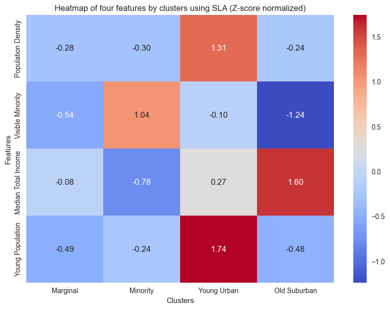

Using the heatmap above, we can obtain four different types of FSA:

-  Cluster 1 Marginal: This type of FSA exhibits the lowest values
   across all four features and is located within Toronto’s suburbs,
   lacking clear geographical characteristics.

-  Cluster 2 Visual Minority: This type of suburban FSA has the highest
   percentage of visual minorities with the lowest median income. This
   cluster is situated in the peripheral regions of Toronto’s suburbs

-  Cluster 3 Young Urban: Concentrated in the central city, this type of
   FSA has the highest average population density and exhibits an
   exceptionally high youth population.

-  Cluster 4 Old Suburban: Predominantly comprising suburban FSAs
   concentrated within the southeast corner and midtown of Toronto with
   the lowest average percentage of young adults, while boasting the
   high average median total income.

Atypical change analysis
^^^^^^^^^^^^^^^^^^^^^^^^

We visulized all FSAs that exhibit change in cluster labels using the
``tsplot`` module within *tscluster*. The ``tsplot.plot()`` function
visualizes the time series of each feature within the selected FSA.

.. code-block:: python

    fig, ax = tsplot.plot(
        X=temporal_data_scaled, # the normalized temporal data
        cluster_centers=sla.cluster_centers_, # the cluster centers
        labels=sla.labels_, label_dict=label_dict, # the cluster labels and the label dictionary
        entity_idx=[label_dict['N'].index(i) for i in sla.get_dynamic_entities()[0]], # the entities that exhibit cluster label changes
        show_all_entities=False,figsize=(7,16), annot_fontsize = 10,
        xlabel='Year',ylabel='Normalized Values'
        ) # show only the entities that exhibit cluster label changes

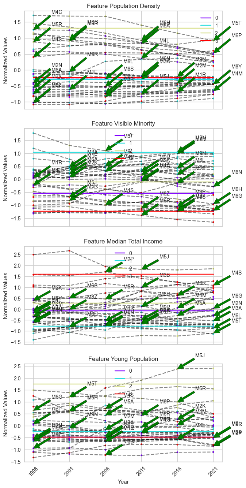

It is challenging to distinguish which FSAs contain the most divergent
changes in the plot above, as there are too many FSAs changing clusters
in this unbounded scheme. Instead, we can use the frequency of cluster
label changes to identify the FSAs with the most divergent changes from
one temporal trend to another. In this case, the FSA with the highest
frequency of label changes will be considered as the sample that
exhibits the most divergent change in temporal trend.

The FSA that exhibits the most frequent cluster label changes can be
directly obtained using the ``get_dynamic_entities()`` function in
*tscluster*. It returns a tuple consisting of a list of labels of
samples that exhibit more than 0 cluster label changes and the number of
cluster labels each sample exhibited, sorted in descending order.

.. code-block:: python

    # The label of the top 5 FSA entites that exhibit the most frequent cluster label changes
    sla.get_dynamic_entities()[0][:5]

.. parsed-literal::

    ['M3B', 'M9R', 'M4S', 'M8Y', 'M6R']

.. code-block:: python

    # The number of cluster label changes for the top 5 FSA
    sla.get_dynamic_entities()[1][:5]

.. parsed-literal::

    [3, 2, 2, 2, 2]

In the example provided, among the top 5 FSAs that exhibit the most
frequent cluster label changes, the FSA ‘M3B’ exhibits 3 changes, while
the rest of the FSAs exhibit 2 changes each. Therefore, ‘M3B’ will be
considered as the FSA with the most divergent change based on our
definition.

To check the cluster label of ‘M3B’, we could utilize the ``labels_``
entity in the clustering result

.. code-block:: python

    sla.labels_[sla.get_index_of_label(sla.get_dynamic_entities()[0][:1])] + 1
    # since python index start from 0, we add 1 to match with the index we used in cluster definition.

.. parsed-literal::

    array([4, 1, 4, 1, 1, 1], dtype=int32)

Based on the previous cluster definitions and cluster labels, we
observed that ‘M3B’ transitioned from ‘Old Suburban’ to ‘Marginal’. To
validate this atypical change, we used the ``tsplot.plot()`` function to
visualize the time series of ‘M3B’ for each feature.

.. code-block:: python

    fig, ax = tsplot.plot(
        X=temporal_data_scaled, # the normalized temporal data
        cluster_centers=sla.cluster_centers_, # the cluster centers
        labels=sla.labels_, label_dict=label_dict, # the cluster labels and the label dictionary
        entity_idx= [label_dict['N'].index('M3B')], # show 'M3B' only
        show_all_entities=False,figsize=(7,16), annot_fontsize = 10,
        xlabel='Year',ylabel='Normalized Values',
        cluster_labels=['Marginal','Minority','Young Urban','Old Suburban']) # the cluster labels (i.e. four type of FSA we defined)

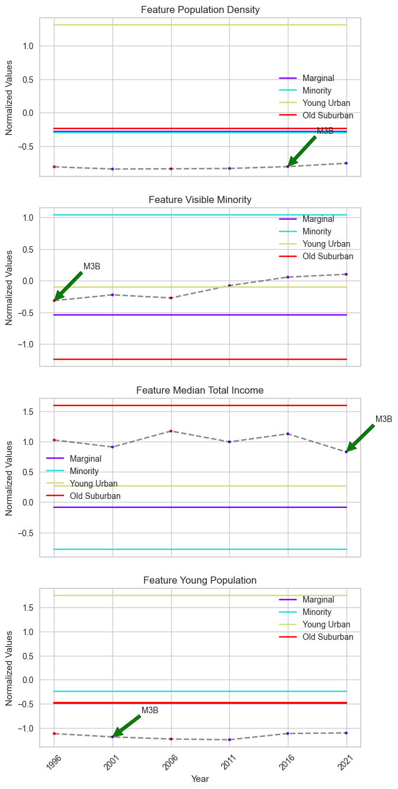

M3B’s features, particularly ‘Median Total Income’, do not show
pronounced changes, although the cluster centers suggest a significant
difference.

To uncover the reason behind this discrepancy, we visualized the
distribution of timestamps within ‘Marginal’ and ‘Old Suburban’ based on
their values in ‘Median Total Income’.

.. code-block:: python

    def scatter(X: np.ndarray, cluster1: int|str, cluster2: int|str, feature:str,
                 cluster_result: OptTSCluster|TSGlobalKmeans|KMeans,
                 cluster_labels: List[str]|None = None,
                 entity_idx: List[str]|List[int]|None = None,
                 label_dict: dict|None = None,
                 figsize: tuple = (10, 7)) -> plt.Figure:
        """
        Visualizing the distribution of timestamps within two clusters based on a seletecd feature.
    
        Parameters
        ----------
        X : np.ndarray
            The temporal data with shape (n_timesteps, n_samples, n_features).
        cluster1 : int|str
            The cluster number of the first cluster.
            If cluster_labels is not None, cluster1 can also be a string within cluster label.
        cluster2 : int|str
            The cluster number of the second cluster.
            If cluster_labels is not None, cluster2 can also be a string within cluster label.
        feature : str
            The feature name.
        cluster_result : OptTSCluster|TSGlobalKmeans|KMeans
            The cluster result from three clustering method of *tscluster*
        cluster_labels : List[str], optional
            The cluster labels, by default None.
            If None, the cluster labels will be 'Cluster 1', 'Cluster 2', ...
            If not None, the cluster labels will be shown in the legend.
        entity_idx : List[str]|List[int], optional
            The entities to show in the scatter plot, by default None.
            If None, no entities will be shown.
        label_dict : dict, optional
            The label dictionary of the temporal data, by default None
            If None, the label dictionary of the cluster result will be used.
        figsize : tuple, optional
            The figure size of the heatmap, by default (10, 7)
    
        Returns
        -------
        plt.Figure
            The scatter plot figure.
        """
        if label_dict is None:
            label_dict = cluster_result.label_dict_
    
        if not (isinstance(cluster1, str) or isinstance(cluster2, str)):
            if cluster1 >= cluster_result.n_clusters or cluster2 >= cluster_result.n_clusters:
                raise ValueError('The cluster number is out of range.')
        else:
            if cluster_labels is None:
                raise ValueError('cluster1 and cluster2 is String but the cluster labels are not provided.')
            else:
                if cluster1 in cluster_labels:
                    cluster1 = cluster_labels.index(cluster1)
                else:
                    raise ValueError('The cluster1 label is not in the cluster labels.')
                if cluster2 in cluster_labels:
                    cluster2 = cluster_labels.index(cluster2)
                else:
                    raise ValueError('The cluster2 label is not in the cluster labels.')
    
        if feature not in label_dict['F']:
            raise ValueError('The feature is not in the feature list.')
    
        else:
            if entity_idx is None:
                entity_idx = []
            if isinstance(entity_idx[0], str):
                entity_idx = [label_dict['N'].index(i) for i in entity_idx]
            cluster1_lst = []
            cluster2_lst = []
            sample_lst = []
            plt.figure(figsize=figsize)
            for fsa in range(X.shape[1]):
                current_fsa = cluster_result.labels_[fsa]
                for year in range(X.shape[0]):
                    if current_fsa[year] == cluster1:
                        cluster1_lst.append(X[year,fsa,label_dict['F'].index(feature)])
                    elif current_fsa[year] == cluster2:
                        cluster2_lst.append(X[year,fsa,label_dict['F'].index(feature)])
                    if fsa in entity_idx:
                        sample_lst.append(X[year,fsa,label_dict['F'].index(feature)])
            if cluster_labels is not None:
                cluster1 = cluster_labels[cluster1]
                cluster2 = cluster_labels[cluster2]
            else:
                cluster1 = 'Cluster ' + str(cluster1+1)
                cluster2 = 'Cluster ' + str(cluster2+1)
            plt.scatter( cluster1_lst, np.ones(len(cluster1_lst)), color='red',
                        label=cluster1,alpha=0.5)
            plt.scatter( cluster2_lst, np.zeros(len(cluster2_lst)), color='blue',
                        label=cluster2,alpha=0.5)
            plt.scatter(sample_lst, [0.5 for _ in range(len(sample_lst))],
                        color='black', marker='x',
                        label=label_dict['N'][entity_idx[0]], s=100)
            plt.xlabel(feature)
            plt.yticks([0,0.5,1], labels=[cluster2, 'Selected Entity', cluster1])
    
            plt.legend(loc='upper right')
        return plt.gcf()

.. code-block:: python

    fig = scatter(X = temporal_data_scaled,
                  cluster1 = 'Marginal',cluster2 = 'Old Suburban',
                  feature='Median Total Income',
                  cluster_result=sla,
                  cluster_labels=['Marginal','Minority','Young Urban','Old Suburban'],
                  entity_idx=['M3B'])
    plt.title('Scatter plot of Median Total Income for Marignal and Old Suburban clusters')
    plt.legend()
    plt.show()

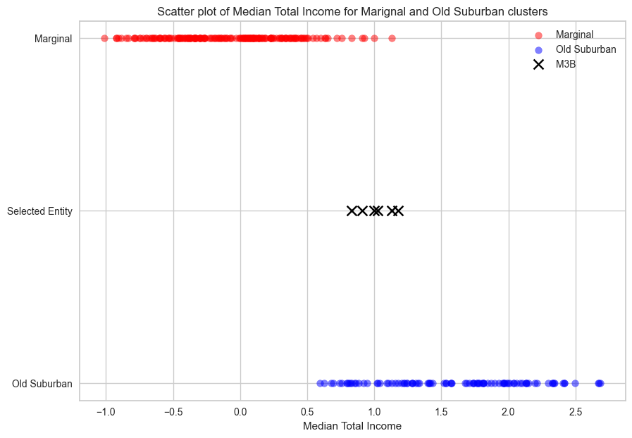

The red encoded scatter represents timestamps within the ‘Marginal’
cluster, which exhibit a lower median total income (x-axis) compared to
the timestamps within the ‘Old Suburban’ cluster (blue encoded scatter).
However, ‘M3B’ (marked as a cross) is located on the boundary between
these two clusters, making it sensitive to statistical noise when
clustering without global optimality (i.e., SLA).

Without incorporating limitation on the maximum allowable label changes,
entities like M3B risk transitioning repeatedly between cluster
boundaries without meaningful data changes.

Clustering result using BDC
~~~~~~~~~~~~~~~~~~~~~~~~~~~

Cluster definition
^^^^^^^^^^^^^^^^^^

To maintain consistency, we used the same method as Sequence Label
Analysis (SLA), which involves calculating the mean of each feature
across timestamps, to define each cluster in the result of Bounded
Dynamic Clustering (BDC).

**Note: The order of cluster might not be consistent across methods due
to initialization. Please validate the mean of each feature in the
heatmap with the detailed cluster definitions provided in the SLA
section to determine the correct order.**

.. code-block:: python

    fig = plot_cluster_heatmap(X = temporal_data_scaled,
                               cluster_result=bdc,
                               n_clusters=4,
                               cluster_labels=['Old Suburban','High Density Urban','Visual Minority','Young Urban'],
                               # assign the cluster labels
                               label_dict = label_dict)
    plt.title('Heatmap of four features by clusters using BDC (Z-score normalized)')
    plt.xlabel('Clusters')
    plt.ylabel('Features')
    plt.show()

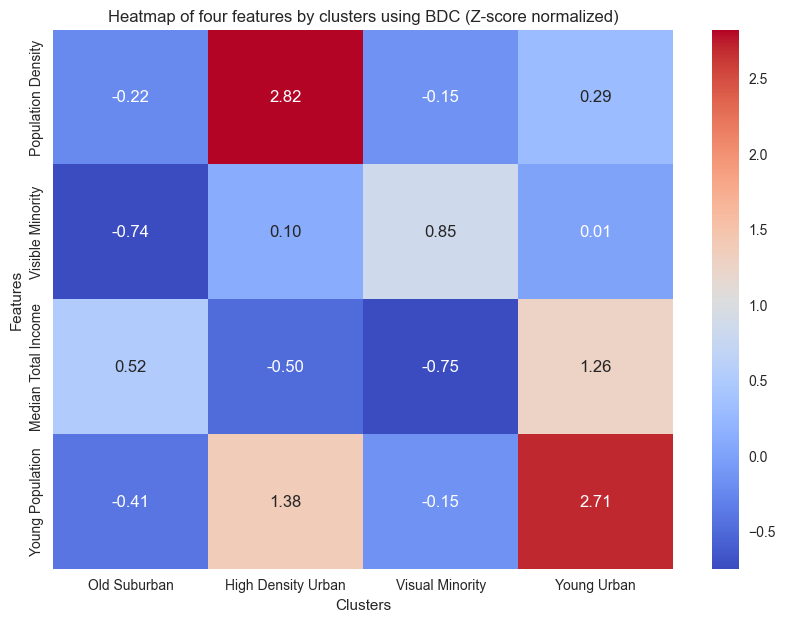

Compared to the result of the SLA, the ‘Young Urban’ exhibits a
significantly lower population density. An additional cluster named
‘High Density Urban’ has a high population density in central Toronto.

Atypical change analysis
^^^^^^^^^^^^^^^^^^^^^^^^

The only FSA that exhibits change in cluster labels is ‘M5E’. We checked
the cluster label of ‘M5E’

.. code-block:: python

    #cluster label of M5E
    cluster_label_bdc[label_dict['N'].index('M5E')] + 1
    # since python index start from 0, we add 1 to match with the index we used in cluster definition.

.. parsed-literal::

    array([1, 1, 1, 4, 4, 4])

M5E spans King Street to Lake Ontario and west from Yonge to Jarvis
Street, incorporating Waterfront Toronto, a major redevelopment project.
The 2000 Toronto Waterfront Revitalization Initiative transformed the
lakeshore into high-density condos, likely influencing population
density trends in M5E from 2000 onwards. This initiative also likely
impacted the distribution of young professionals, who have a high demand
in the condominium market .

In clustering results, M5E transitioned from ‘Old Suburban’ to ‘Young
Urban’ in 2006. Among the four socioeconomic features we used in
clustering, this transition is captured by changes in ‘young population’
and \`population density.’

We can validate this change with its time series in these two features.

.. code-block:: python

    tsplot.plot(
        X=temporal_data_scaled, # the normalized temporal data
        cluster_centers=bdc.cluster_centers_, # the cluster centers
        labels=bdc.labels_, label_dict=label_dict, # the cluster labels and the label dictionary
        entity_idx= [label_dict['N'].index('M5E'), label_dict['N'].index('M3B')], # show 'M5E' and 'M3B' only
        show_all_entities=False,figsize=(7,16), annot_fontsize = 10,
        xlabel='Year',ylabel='Normalized Values',
        cluster_labels=['Old Suburban','High Density Urban','Visual Minority','Young Urban']) # the cluster labels (i.e. four type of FSA we defined)
    plt.show()

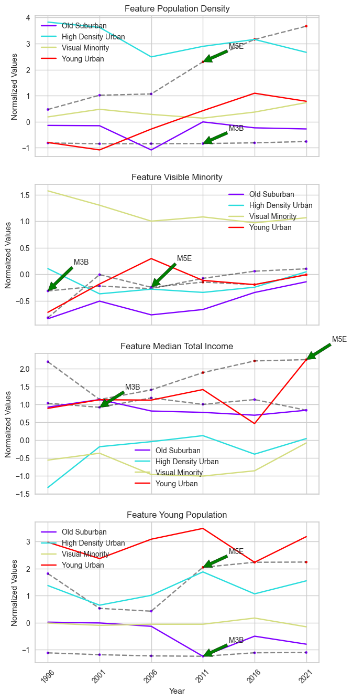

We compared the time series of ‘M3B’ with ‘M5E’ across the four
features. In ‘M5E’, significant increases in both features are observed
from 2006 onward, coinciding with its transition from ‘Old Suburban’ to
‘Young Urban’ under BDC. From the scatter plot below, we observed a
clear boundary in ‘M5E’ timestamps indicating the transition from one
cluster to another.

.. code-block:: python

    fig = scatter(X = temporal_data_scaled,
                  cluster1 = 'Young Urban',cluster2 = 'Old Suburban',
                  feature='Young Population',
                  cluster_result=bdc,
                  cluster_labels=['Old Suburban','High Density Urban','Visual Minority','Young Urban'],
                  entity_idx=['M5E'],
                  label_dict = label_dict)
    plt.title("Distribution of timestamps within 'Young Urban' and 'Old Suburban' clusters based on 'Young Population' feature")
    plt.legend()
    plt.show()

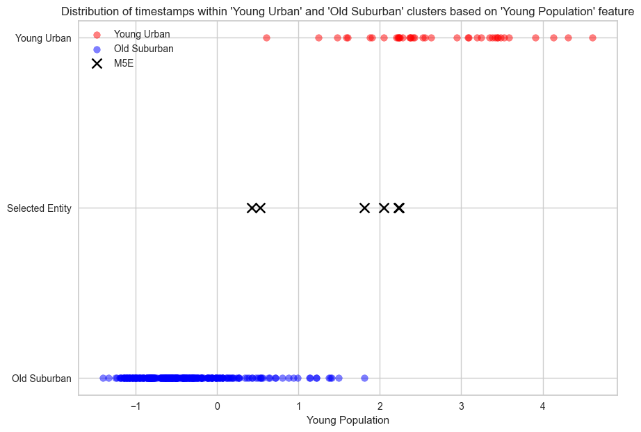

It is worth noting that M5E is located in the Toronto Urban Area, which
contradicts the geographical definition of \`Old Suburban’, one of the
neighbourhood types it belongs. Since geographical locations are not one
of the four features we used in clustering, the geographical definition
of each FSA type is based on a post-hoc evaluation of FSAs within each
cluster. Therefore, only differences in the four features should be
considered when we analyzed cluster label changes, and M5E correctly
reflects these differences.

In short, BDC, a novel temporal clustering method in \`tscluster’,
demonstrates significant advantages over SLA in identifying atypical
FSAs in this case study. BDC successfully captures the most divergent
transition of M5E, reflecting the real-world impact of the Toronto
Waterfront Revitalization Initiative, while avoiding misidentifying FSAs
such as M3B that are susceptible to statistical noise. Moreover, BDC
retains the ability to summarize cluster definitions similar to SLA.

Appendix 1: Clustering result using SLA with global optimality
--------------------------------------------------------------

Another potential solution for the statistical noise problem on the
boundary of two clusters, which we encountered when using SLA with
K-means (i.e. ``GlobalKmeans`` in *tscluster*), is to use MILP
formulation for the SLA method. This method guarantees optimality and is
available in *tscluster*. We applied this clustering method in the
Toronto neighbourhood changes case study.

.. code-block:: python

    # Using OptTsCluster
    from tscluster.opttscluster import OptTSCluster
    # initialize the OptTSCluster with the number of clusters = 4
    sla_opt = OptTSCluster(
        k=4, # 4 cluster
        scheme='z0c1', # static center, dynamic assignment
        n_allow_assignment_change=None, # unbounded number of allowed assignment changes
        random_state=42,
        warm_start=False # warm start is not used
    )
    # clustering the normalized temporal data with SLA
    sla_opt.fit(temporal_data_scaled)

.. parsed-literal::

    Obj val: [3.95967354]
    
    Total time is 103.24secs
    
    

.. parsed-literal::

    <tscluster.opttscluster.opttscluster.OptTSCluster at 0x3e2b41580>

Cluster definition
~~~~~~~~~~~~~~~~~~

.. code-block:: python

    fig = plot_cluster_heatmap(X = temporal_data_scaled,
                               cluster_result=sla_opt,
                               n_clusters=4,
                               cluster_labels=['High Density Urban','Young Urban',
                                               'Old Suburban','Visual Minority'],
                               # assign the cluster labels
                               label_dict = label_dict)
    plt.title('Heatmap of four features by clusters using MILP based SLA (Z-score normalized)',fontsize=15)
    plt.show()

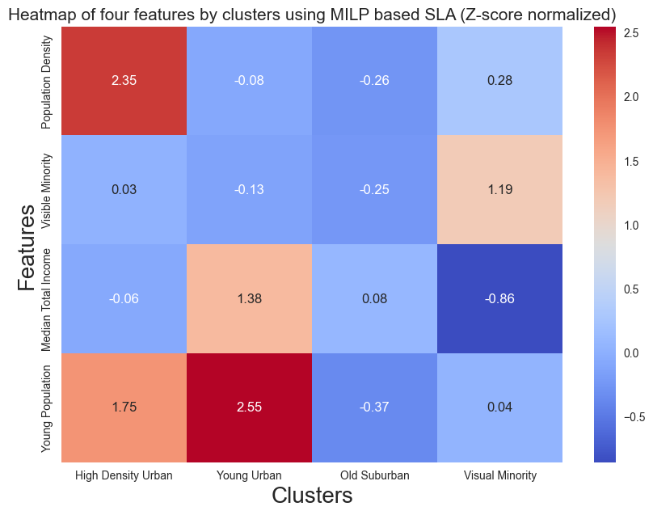

The clustering definition from SLA with global optimality shows a
similiar result as BDC, which includes ‘High Density Urban’ and elimates
the ‘Marginal Cluster’.

Atypical change analysis
~~~~~~~~~~~~~~~~~~~~~~~~

Top 5 FSAs with the most frequent label change

.. code-block:: python

    sla_opt.labels_[sla_opt.get_dynamic_entities()[0]][:5]

.. parsed-literal::

    array([[2, 2, 3, 2, 3, 2],
           [1, 0, 3, 1, 0, 0],
           [3, 0, 3, 2, 2, 2],
           [0, 0, 3, 2, 2, 3],
           [2, 3, 2, 2, 2, 2]])

.. code-block:: python

    [label_dict['N'][i][:5] for i in sla_opt.get_dynamic_entities()[0]][:5]

.. parsed-literal::

    ['M2M', 'M5E', 'M6J', 'M6H', 'M9W']

number of changes each FSA has

.. code-block:: python

    sla_opt.get_dynamic_entities()[1][:5]

.. parsed-literal::

    [4, 4, 3, 3, 2]

Note that SLA with global optimality is able to identify ‘M5E’ as one of
the FSAs with the most divergent change. We also visualized another FSA
with the most frequent number of changes: ‘M2M’.

.. code-block:: python

    tsplot.plot(
        X=temporal_data_scaled, # the normalized temporal data
        cluster_centers=sla_opt.cluster_centers_, # the cluster centers
        labels=sla_opt.labels_, label_dict=label_dict, # the cluster labels and the label dictionary
        entity_idx= sla_opt.get_dynamic_entities()[0][:2], # show the entities that exhibit cluster label changes
        show_all_entities=False,figsize=(7,16), annot_fontsize = 10,
        cluster_labels=['High Density Urban','Young Urban',
                        'Old Suburban','Visual Minority'], # the cluster labels (i.e. four type of FSA we defined)
        xlabel='Year',ylabel='Normalized Values') # the cluster labels (i.e. four type of FSA we defined)
    plt.show()

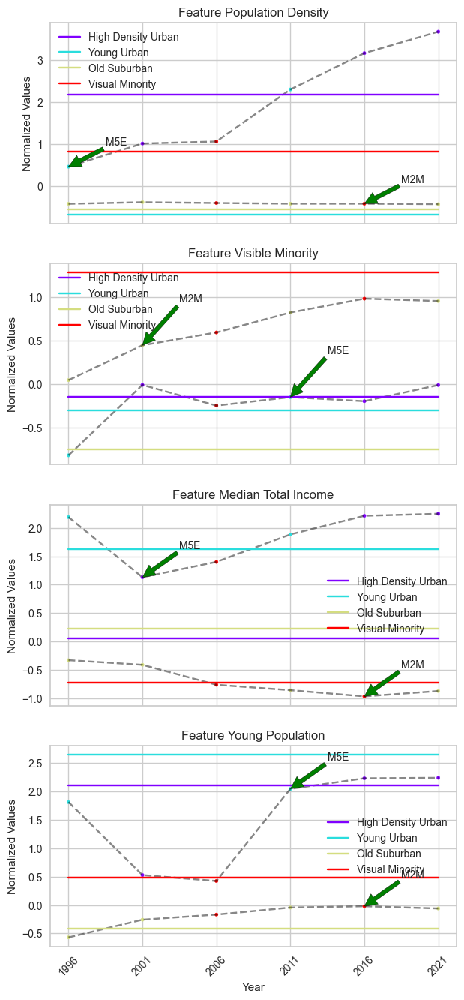

When using SLA with global optimality, two FSAs exhibit the same most
frequent changes in their cluster labels. These FSAs include M5E, which
was identified with BDC, and M2M, which also exhibits 4 changes in its
cluster labels.

However, compared to BDC, there are two disadvantages. First, the change
in cluster labels does not fully match the change in time series
features. Due to the unbounded nature, there are more changes in cluster
labels than changes in the features’ time series. Second, the cluster
centers remain static points, which limits our ability to fully identify
temporal trends from the cluster centers, unlike BDC.
